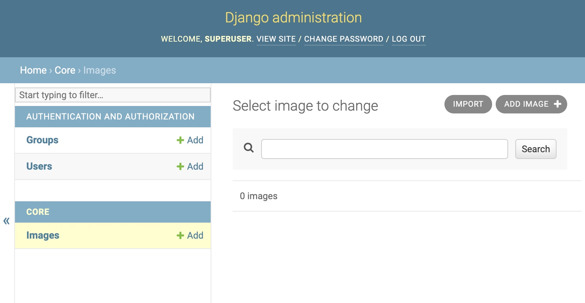
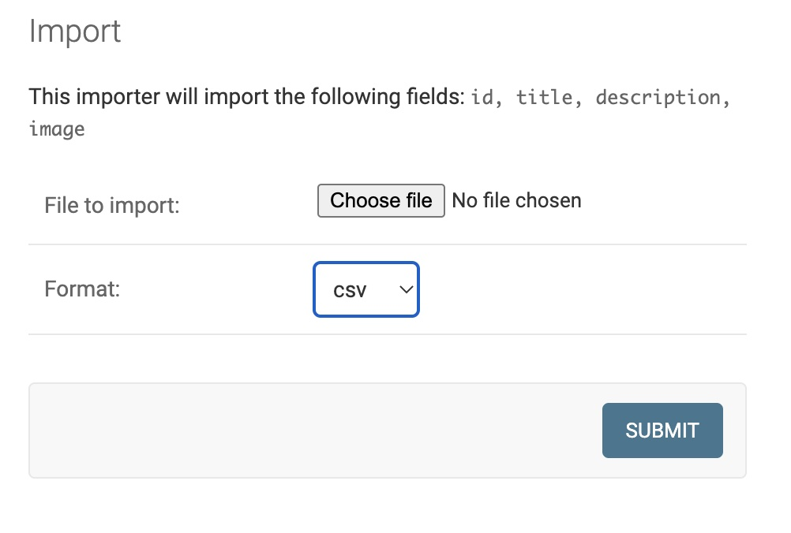
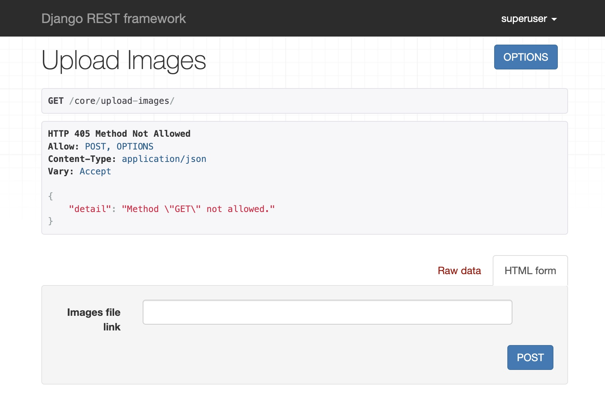
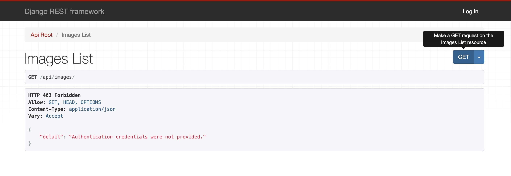
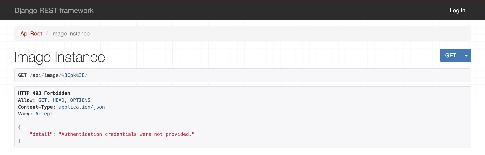

# Images API

This API is used to give images data by using a csv that can be dumped into the DB via Post call or directly uploading csv file from django admin

# Setup 

## Virtual Environment (on Mac OS)


- Install PyEnv
```
$ brew update
$ brew install pyenv
$ echo -e 'if command -v pyenv 1>/dev/null 2>&1; then\n  eval "$(pyenv init --path)"\nfi' >> ~/.bash_profile
```
- Install required Python version by using pyenv 
```
$ pyenv install 3.10.3
```
- check python version and creating python shell
```
$ pyenv versions
$ pyenv shell 3.10.3
```
- Go to project dir
```
$ cd ~/elements_assginment
```
- Create virtual environment
```
$ python -m venv .venv
```
- Install all needed packages
```
$ pip install -r requirements.txt
```
- Run Migrations
```
$ python manage.py makemigrations 
$ python manage.py migrate
```
- Start local server
```
$ python manage.py runserver
```
This should run the server and you may check the endpoints : [Endpoints](#available-end-points)  

Create a super user to look into the data in admin panel imported into DB via csv

- create superuser
```
$ python manage.py createsuperuser --email admin@example.com --username admin
                    
(Choose your own password)
```

The other option ( in case if you work with windows or any other OS ,
have docker installed in your system with below setup)

## Docker SetUp

- install docker -->  Ref: https://docs.docker.com/get-docker/
```
Install the docker and docker-cpmpose as per your OS
```

- Go to project folder and Run 
```
docker-compose up
```

- create superuser
```
get the container id from $ docker ps
$ docker exec -it <container_id> python manage.py createsuperuser --email admin@example.com --username admin
                    
(Choose your own password)
```


# Available End Points 
```
Need to Login for all end points with the super user credentials
```
- For admin console use http://localhost:8000/admin/

- Rest API's

    - For uploading csv link with images  http://localhost:8000/api/upload-images/
    - For all available images list  http://localhost:8000/api/images
    - For single image instance  http://localhost:8000/api/image/<pk>
    
## Setup to read csv data as file upload or via link.
- ##### Option1: Via file upload with django admin
    - go to admin panel of images http://localhost:8000/admin/api/image/
    - Login with your credentials
    - select *import* button on top right corner
    
        
    - select csv file and click on submit 
    
        
    - confirm the import then your data gets imported if everything is fine with the file.
    - If the file is invalid it will give the errors.
    
- ##### Option2: Via CSV File Link.
    - go to the POST endpoint http://localhost:8000/api/upload-images/
    - Login with your credentials
    - give *images_file_link* in and hit the POST button.
        
    - If CSV is valid you will get *success* response.
    - If CSV is invalid you will get *invalid csv* response.
    
- ##### Sample CSV file format: [test_application_data.csv](test_application_data.csv)
    
    
## GET Images Endpoint
- go to the api http://localhost:8000/api/images/
        
- Login with your credentials
- Hit the GET button, you will get all images information with pagination. 

## GET Image Details Endpoint
- go to the api http://localhost:8000/api/image/<pk>
        - pk : image id
        
- Login with your credentials
- Hit the GET button, you will get required image details. 


    
      


